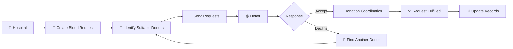

# <p align="center">🩸 RakhtSetu

<p align="center">
  <strong>A Community Blood Donation & Emergency Coordination Platform</strong>
</p>

<p align="center">
  Connecting Donors, Hospitals, NGOs and Communities through a unified digital blood network.
</p>

<p align="center">


</p>

---

## 📌 Overview

**RakhtSetu** is a community-driven blood donation coordination platform designed to connect **blood donors, hospitals, NGOs and volunteers** through a unified digital ecosystem.

The platform helps hospitals create blood requirements, identify suitable donors, coordinate responses and manage operational information. Donors can manage their availability, receive blood requests and respond to them, while NGOs can support community-level coordination.

### 🎯 Vision

> **Connect. Respond. Donate. Save Lives. ❤️**

RakhtSetu focuses on making blood-donation coordination more organized, responsive and accessible through technology.

---

# 🔄 How RakhtSetu Works

```mermaid
flowchart TD

    A["👤 User Registration"] --> B{"Select Role"}

    B --> C["🩸 Donor"]
    B --> D["🏥 Hospital"]
    B --> E["🤝 NGO"]

    %% DONOR
    C --> C1["Create / Update Profile"]
    C1 --> C2["Set Blood Group & Location"]
    C2 --> C3["Manage Availability"]
    C3 --> C4["Receive Blood Requests"]
    C4 --> C5{"Respond to Request"}

    C5 -->|Accept| C6["Donation Coordination"]
    C5 -->|Decline| C7["Request Reassignment"]

    %% HOSPITAL
    D --> D1["Hospital Dashboard"]
    D1 --> D2["Create Blood Request"]
    D2 --> D3["Enter Blood Group & Units"]
    D3 --> D4["Request Processing"]
    D4 --> D5["Find Suitable Donors"]
    D5 --> D6["Send Donor Requests"]
    D6 --> D7["Track Responses"]
    D7 --> D8["Manage Patients & Reports"]

    %% NGO
    E --> E1["NGO Dashboard"]
    E1 --> E2["Coordinate Blood Donation"]
    E2 --> E3["Connect Donors & Hospitals"]
    E3 --> E4["Community Outreach"]

    %% BACKEND
    C6 --> F["⚙️ RakhtSetu Application"]
    C7 --> F
    D4 --> F
    D6 --> F
    D7 --> F
    E3 --> F

    F --> G["🗄️ Supabase"]
    G --> H["📊 Data & Analytics"]

    H --> I["🚨 Faster Request Coordination"]
    H --> J["🤝 Better Donor Connectivity"]
    H --> K["❤️ Stronger Community Network"]
---

# 🏗️ System Architecture

```mermaid
flowchart LR

    U["👥 Platform Users"]

    U --> D["🩸 Donor Portal"]
    U --> H["🏥 Hospital Portal"]
    U --> N["🤝 NGO Portal"]

    D --> F["⚛️ React Frontend"]
    H --> F
    N --> F

    F --> R["🔀 React Router"]
    R --> A["⚙️ Application Logic"]

    A --> S["⚡ Supabase"]

    S --> DB["🗄️ PostgreSQL"]
    S --> AUTH["🔐 Authentication"]
    S --> RLS["🛡️ Row Level Security"]

    A --> MAP["🗺️ Leaflet Maps"]
    A --> ANA["📊 Analytics"]

    DB --> REQ["📨 Blood Requests"]
    DB --> PAT["🧑‍⚕️ Patient Records"]
    DB --> RES["💬 Donor Responses"]

    REQ --> OUT["❤️ Blood Donation Coordination"]
    RES --> OUT
```

---

# 🩸 Blood Request Flow



---

# 👥 User Roles

| Role | Responsibilities |
|------|------------------|
| 🩸 **Donor** | Manage profile, blood group, location, availability and respond to blood requests |
| 🏥 **Hospital** | Create blood requests, manage patients, coordinate donors and view reports |
| 🤝 **NGO** | Support blood donation coordination, community outreach and donor-hospital connectivity |

---

# ✨ Key Features

## 🩸 Donor Dashboard

- Donor profile management
- Blood group and location information
- Availability management
- Blood request management
- Donor response system
- Donation history
- Nearby donor/network features
- Notifications
- Rewards and recognition
- Donor badges
- Impact tracking

---

## 🏥 Hospital Dashboard

- Hospital dashboard
- Blood request management
- Patient management
- Interactive donor map
- Donor coordination
- Request tracking
- Reports and analytics
- Hospital settings
- Hospital operations database
- Map-based donor visualization

---

## 🤝 NGO Dashboard

- NGO dashboard
- Community blood donation coordination
- Donor-hospital connectivity
- Community outreach support
- NGO-specific dashboard interface

---

# 🧩 Core Modules

```text
RakhtSetu
│
├── 🩸 Donor Module
│   ├── Dashboard
│   ├── Availability
│   ├── Requests
│   ├── Responses
│   ├── History
│   ├── Nearby Donors
│   ├── Network
│   ├── Rewards
│   ├── Profile
│   ├── Notifications
│   └── Settings
│
├── 🏥 Hospital Module
│   ├── Dashboard
│   ├── Blood Requests
│   ├── Patients
│   ├── Reports
│   ├── Interactive Map
│   └── Settings
│
├── 🤝 NGO Module
│   └── Dashboard
│
└── ⚙️ Backend Services
    ├── Authentication
    ├── Database
    ├── Request Management
    ├── Donor Responses
    └── Analytics
```

---

# 🛠️ Technology Stack

## Frontend

- **React**
- **TypeScript**
- **Vite**
- **Tailwind CSS**
- **React Router**
- **Framer Motion**
- **Lucide React**

## Backend & Database

- **Supabase**
- **PostgreSQL**
- **Supabase Authentication**
- **Row Level Security**

## Maps & Location

- **Leaflet**
- **Leaflet MarkerCluster**

## Development Tools

- **Git**
- **GitHub**
- **npm / pnpm**
- **VS Code**

---

# 🔐 Security

RakhtSetu uses role-based access and database-level security mechanisms to separate functionality between different platform users.

### Security Features

- Authentication
- Role-based protected routes
- Supabase Row Level Security
- User-specific data access
- Protected dashboard routes

---

# 📊 Database

RakhtSetu uses **Supabase PostgreSQL** for application data.

```text
Users
  │
  ├── Donors
  │     ├── Profile
  │     ├── Availability
  │     ├── History
  │     └── Responses
  │
  ├── Hospitals
  │     ├── Requests
  │     ├── Patients
  │     └── Reports
  │
  └── NGOs
        └── Community Coordination
```

Hospital-specific database operations are maintained through the project's Supabase migration files.

---

# 🚀 Getting Started

## 1. Clone the Repository

```bash
git clone https://github.com/Komal2008/RakhtSetu.git
```

## 2. Navigate to the Project

```bash
cd RakhtSetu
```

## 3. Install Dependencies

Using npm:

```bash
npm install
```

Or using pnpm:

```bash
pnpm install
```

## 4. Configure Environment Variables

Create a `.env` file in the project root:

```env
VITE_SUPABASE_URL=your_supabase_url
VITE_SUPABASE_ANON_KEY=your_supabase_anon_key
```

> ⚠️ Never commit your `.env` file or expose private API keys.

## 5. Start Development Server

```bash
npm run dev
```

Or:

```bash
pnpm dev
```

---

# 📁 Project Structure

```text
RakhtSetu/
│
├── public/
│   └── sounds/
│
├── src/
│   │
│   ├── components/
│   │   ├── donor/
│   │   ├── hospital/
│   │   └── layout/
│   │
│   ├── context/
│   │
│   ├── data/
│   │
│   ├── pages/
│   │   ├── donor/
│   │   ├── hospital/
│   │   └── ngo/
│   │
│   ├── App.tsx
│   └── main.tsx
│
├── supabase/
│   ├── schema.sql
│   └── hospital-operations-migration.sql
│
├── package.json
├── vite.config.ts
└── README.md
```

---

# 🔀 Git Workflow

The project uses feature branches for major modules.

```text
main
 │
 ├── feature/donor-dashboard-complete
 │
 ├── feature/hospital-dashboard-complete
 │
 └── feature/ngo-dashboard-complete
```

Each dashboard is developed independently and integrated through pull requests.

---

# 📌 Development Progress

| Module | Status |
|--------|--------|
| 🩸 Donor Dashboard | ✅ Completed |
| 🏥 Hospital Dashboard | ✅ Completed |
| 🤝 NGO Dashboard | ✅ Completed |
| 🔐 Authentication | ✅ Implemented |
| 🗄️ Supabase Integration | ✅ Implemented |
| 🗺️ Interactive Maps | ✅ Implemented |
| 📊 Reports | ✅ Implemented |
| 🧑‍⚕️ Patient Management | ✅ Implemented |
| 📨 Blood Request Management | ✅ Implemented |

---

# 🎯 Future Scope

Potential future improvements include:

- Real-time donor availability updates
- Advanced donor matching
- Emergency request prioritization
- Notification automation
- Blood inventory integration
- Hospital and blood-bank verification
- Advanced analytics
- Mobile application
- Community engagement and volunteer management

---

# ❤️ Impact

RakhtSetu is designed around a simple idea:

> **When someone needs blood, finding the right donor should be faster and more coordinated.**

By connecting hospitals, donors and community organizations on a common platform, RakhtSetu provides a digital foundation for more organized blood-donation coordination.

---


This project is developed for educational, research and project-development purposes.

---

<p align="center">
  <strong>🩸 RakhtSetu — Connect. Respond. Donate. Save Lives. ❤️</strong>
</p>
